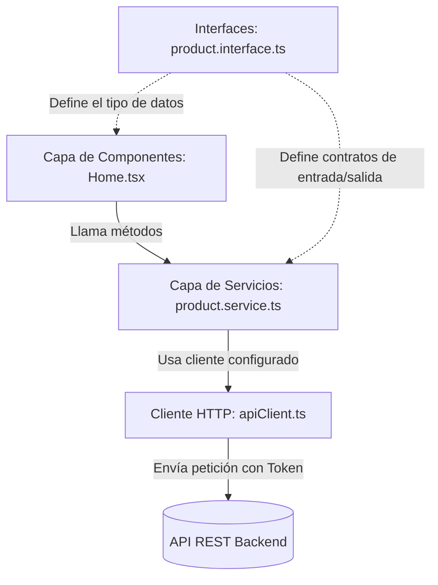

# Guía Explicativa: Integración de Axios y Arquitectura de Servicios de API

Este documento detalla la estructura, las decisiones de diseño y el propósito de cada archivo creado o modificado durante la instalación e integración de **Axios** en el proyecto. El objetivo es servir como material de estudio para entender las bases del consumo de APIs en aplicaciones React profesionales con TypeScript.

---

## 1. Arquitectura del Flujo de Datos

Cuando consumimos una API, es una mala práctica realizar peticiones (`fetch` o `axios`) directamente dentro de los componentes visuales (como páginas o botones). Si lo hacemos:
- El código se vuelve difícil de mantener y duplicado.
- Si la URL del backend cambia, tendríamos que buscar y modificar cada componente.
- Es muy difícil realizar pruebas unitarias.

Por eso, implementamos una **arquitectura por capas**:



---

## 2. Explicación de los Archivos Creados y Modificados

### A. El Cliente Centralizado: `src/services/apiClient.ts`

**¿Por qué existe este archivo?**
Creamos este archivo para centralizar la configuración global de todas nuestras peticiones de red. En lugar de escribir la URL base (`http://localhost:3000`) en cada petición, creamos una **instancia** configurada de Axios.

**Análisis de código clave:**
1. **`axios.create({...})`**: Define la configuración inicial. 
   - `baseURL`: Define la dirección del backend. Usamos `import.meta.env.VITE_API_URL || 'http://localhost:3000'` para que en producción sea dinámico usando variables de entorno, y en desarrollo tome el puerto por defecto de NestJS/Express.
   - `headers`: Declaramos que por defecto enviaremos y recibiremos JSON.
2. **Interceptor de Petición (`request interceptor`)**:
   - **Propósito**: Antes de que una petición salga de tu navegador hacia el servidor, este interceptor "se entromete". Busca en el almacenamiento del navegador (`localStorage`) si existe un token guardado bajo la clave `token`. Si existe, añade la cabecera `Authorization: Bearer <token>`.
   - **Por qué**: De esta manera, el programador no tiene que recordar enviar el token manualmente en cada llamada protegida (como crear productos o ver favoritos); Axios lo hace solo en segundo plano.
3. **Interceptor de Respuesta (`response interceptor`)**:
   - **Propósito**: Cuando el servidor responde con un error, este interceptor lo procesa primero.
   - **Por qué**: Si la respuesta tiene un estatus `401 Unauthorized` (lo que significa que tu sesión expiró o tu token es inválido), el interceptor borra el token inservible con `localStorage.removeItem('token')`. Esto previene fallos en cascada en la interfaz y prepara la app para redirigir al usuario al formulario de login.

---

### B. Capa de Modelos e Interfaces (`src/interfaces/`)

En TypeScript, las interfaces no generan código JavaScript final (son borradas al compilar), pero son críticas en desarrollo porque definen "contratos" de cómo lucen nuestros datos. Esto previene errores comunes como escribir mal el nombre de una propiedad (ej. `product.prisce` en lugar de `product.price`).

#### 1. `auth.interface.ts`
- **`UserResponseDto`**: Define cómo luce el perfil de un usuario que devuelve el backend.
- **`AuthResponseDto`**: El backend devuelve un objeto que contiene el token JWT (`accessToken`) y los datos del usuario (`user`). Esta interfaz representa esa estructura exacta.
- **`LoginDto` y `RegisterDto`**: Representan el objeto de datos que el frontend debe enviar al backend al iniciar sesión o registrarse. 
  - *Nota*: La sigla **DTO** significa *Data Transfer Object* (Objeto de Transferencia de Datos). Se usa para describir la estructura de datos que viaja a través de la red.

#### 2. `category.interface.ts`
- **`Category`**: La estructura completa de una categoría en la base de datos (con `id`).
- **`CreateCategoryDto`**: La estructura necesaria para *crear* una categoría. No tiene `id`, porque el ID lo autogenera la base de datos del backend.
- **`UpdateCategoryDto`**: Todos los campos son opcionales (`?`), porque al actualizar una categoría mediante un método HTTP `PATCH`, podemos decidir enviar solo el nombre, solo la descripción, o ambos.

#### 3. `product.interface.ts`
- **`Product`**: Modela un producto en el sistema. Relaciona la propiedad `category` de tipo `Category` si el backend la incluye resuelta.
- **`ProductQuery`**: Modela los parámetros que podemos enviar en la URL al buscar productos (ej. `?search=audifonos&page=1&limit=10`). Al tiparlo, evitamos enviar parámetros de búsqueda inválidos.
- **`PaginatedProductsResponse`**: Cuando haces `GET /products`, el backend no devuelve un arreglo simple, sino un objeto con metadatos de paginación:
  ```json
  {
    "data": [],
    "total": 0,
    "page": 1,
    "limit": 10,
    "totalPages": 0
  }
  ```
  Tipar esta respuesta es indispensable para saber cuántas páginas existen y poder dibujar la paginación en el frontend.

---

### C. Capa de Servicios (`src/services/`)

Los servicios son objetos que agrupan las funciones que hacen peticiones HTTP relacionadas con un recurso específico.

#### 1. `auth.service.ts`
- **`register` y `login`**: Hacen la petición POST correspondiente. Adicionalmente, guardan automáticamente el token devuelto en el `localStorage` mediante `localStorage.setItem('token', response.data.accessToken)`. Esto ahorra que el componente visual tenga que gestionar el almacenamiento del token.
- **`logout`**: Envía una petición al servidor para avisar el cierre de sesión y, pase lo que pase (`finally`), elimina el token local para limpiar la sesión.

#### 2. `product.service.ts`
- Contiene los métodos CRUD (`findAll`, `findOne`, `create`, `update`, `remove`).
- En `findAll(query)`, pasamos los parámetros de búsqueda usando `{ params: query }`. Axios automáticamente los convierte en formato query string en la URL (ej. `/products?search=Laptop&limit=5`).

#### 3. `category.service.ts`
- Gestiona las llamadas de categorías. Es muy similar a productos pero adaptado al esquema de categorías.

#### 4. `favorite.service.ts`
- Gestiona la relación del usuario con sus productos favoritos. En Swagger, la ruta para agregar favoritos requiere pasar el ID en la URL (`POST /favorites/{productId}`). Reflejamos esto con:
  ```typescript
  await apiClient.post(`/favorites/${productId}`);
  ```

---

### D. Componente Demostrativo: `src/pages/auth/Home.tsx`

**¿Por qué cambiamos este archivo?**
Originalmente tenía solo texto plano. Lo modificamos para conectar todo nuestro flujo de red y demostrar el uso práctico de la arquitectura en un componente real.

**Proceso de la lógica implementada:**
1. **Estados locales**:
   - `products`: Almacena el arreglo de productos obtenidos.
   - `loading`: Booleano para saber si la petición de red está en curso (y mostrar un indicador de carga).
   - `error`: Cadena de texto para capturar cualquier fallo de red y mostrar un mensaje amigable al usuario.
2. **`useEffect`**:
   - Se ejecuta una única vez cuando el componente se monta.
   - Invoca a `productService.findAll()`.
   - Si la promesa se resuelve con éxito, guarda los datos en `products`.
   - Si falla (ej. el backend está apagado), atrapa el error en el bloque `catch` y llena el estado `error`.
   - Finalmente (`finally`), apaga el estado `loading` para ocultar el spinner de carga.
3. **Renderizado condicional**:
   - **Caso Loading**: Muestra un spinner animado en Tailwind.
   - **Caso Error**: Muestra un banner rojo con el mensaje de error.
   - **Caso Vacío (`products.length === 0`)**: Un estado vacío muy estético que explica que no hay productos y proporciona un botón para ir a la documentación de Swagger para crearlos.
   - **Caso Éxito**: Dibuja una cuadrícula adaptativa (`grid grid-cols-1 sm:grid-cols-2 md:grid-cols-3...`) con tarjetas detalladas que muestran la imagen del producto, su stock, nombre, descripción y precio formateado.

---

## 3. ¿Por qué tuvimos que cambiar `import { ... }` a `import type { ... }`?

Durante la verificación del build (`npm run build`), TypeScript arrojó múltiples errores parecidos a este:
> *error TS1484: 'Category' is a type and must be imported using a type-only import when 'verbatimModuleSyntax' is enabled.*

### ¿Por qué ocurrió esto?
En tu archivo `tsconfig.json` (o los configuradores tsconfig heredados en Vite), está activada la regla `"verbatimModuleSyntax": true`.
Esta regla obliga a que se distinga explícitamente qué importaciones son de código en tiempo de ejecución (funciones, variables, clases de JS) y cuáles son meramente tipos de TypeScript en tiempo de diseño (interfaces, tipos abstractos).

- **Antes (Incorrecto bajo esa regla):**
  ```typescript
  import { Category } from "./category.interface";
  ```
  El compilador de TypeScript duda si dejar o quitar esta importación al compilar a JS, porque no sabe a simple vista si `Category` es un objeto JS o solo una interfaz TypeScript.

- **Ahora (Correcto):**
  ```typescript
  import type { Category } from "./category.interface";
  ```
  Al anteponer la palabra clave `type`, le garantizamos al compilador: *"Oye, esto es puramente una interfaz de TS. Puedes eliminar esta línea por completo cuando conviertas este archivo a JavaScript plano"*. Esto reduce el peso del bundle compilado y optimiza la velocidad de transpilación.
